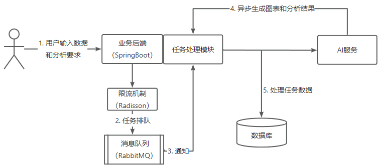
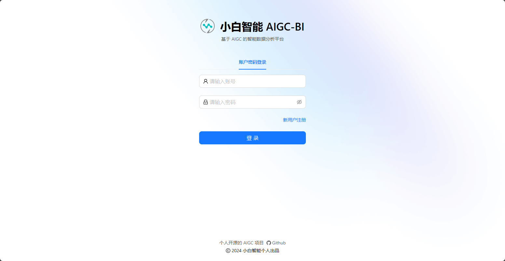
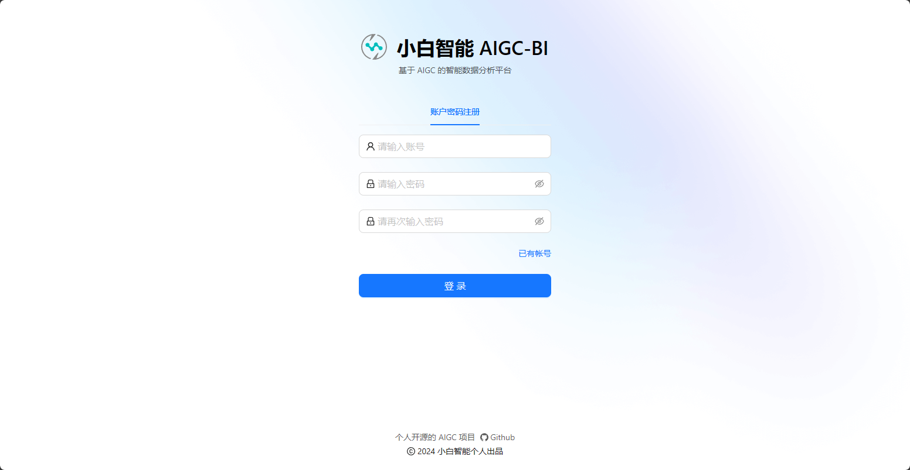
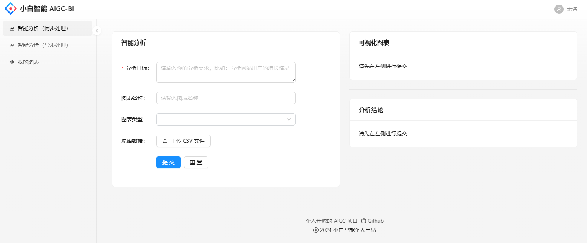
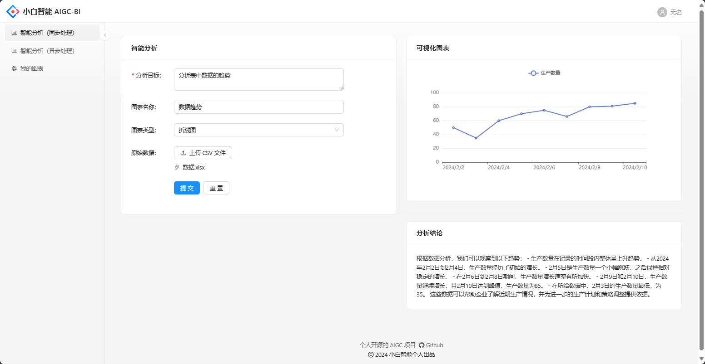
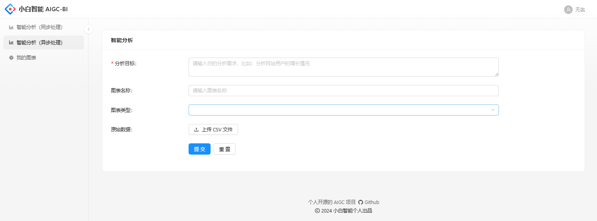
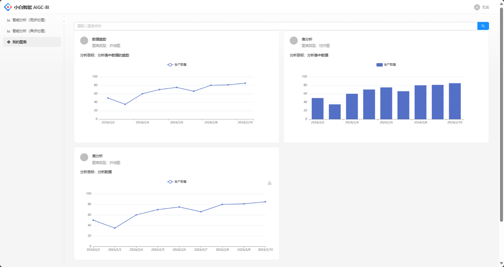

# 小白智能 BI 分析平台

基于 Java SpringBoot 的项目初始模板，整合了常用框架和主流业务的示例代码。

[toc]

## 项目简介

### 项目介绍

​	基于Spring Boot、Radisson、RabbitMQ和AIGC（OpenAI接口）的智能数据分析平台，与传统的BI系统有着显著区别。用户只需导入原始数据并提交分析请求，即可自动生成可视化图表和分析结论，从而实现数据分析的成本降低和效率提升。

### 项目架构

## 功能截图
登陆界面

注册界面

主界面

同步分析

异步分析

我的图表

